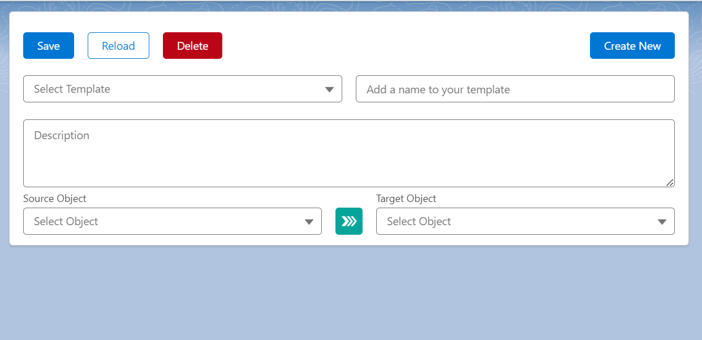

## Object Mapping Setup Tool

The Field Mapping Setup Tool for setting up custom and standard Salesforce
SObject field mappings with providing a user-friendly interface.

See usage in the [Object Conversion Tool](https://github.com/p-adrian05/object-conversion-tool)

- The Lightning Web Component include features such as add, edit and delete field mappings,
  and the ability to save, load, reload and delete the mapping configurations called templates.
- It allows to select the source and target objects and fields and to traverse up to 5 levels of relationships.




```html
 <c-object-mapping-table onmappingtemplatechange={handleMappingTemplateChange}>
</c-object-mapping-table>
```
### Attributes
- title: The title of the mapping setup tool.
- target-object-api-names: The list of target (convert from) object api names to filter the selectable templates and source objects by.
- source-object-api-names: The list of source (convert to) object api names to filter the selectable templates and target objects by.
- template-select-disable: The flag to disable the template to change, clear or delete after it is loaded,only save and reload are allowed.
- hide-field-mappings: The flag to hide the field mappings and only show the template selector.
- read-only: The flag to make the field mappings read-only, and only show the template selector and field mappings.
- onmappingtemplatechange: The event handler to handle the mapping template change event.
  - Returns the mapping template id, source object api name and target object api name.
```javascript
handleMappingTemplateChange(event){
  this.selectedTemplateId= event.detail.id;
  this.selectedSourceObjectApiName = event.detail.sourceObjectApiName;
  this.selectedTargetObjectApiName = event.detail.targetObjectApiName;
}
```
### Invocable Methods
- loadMappingTemplate: Loads the mapping template by the given mapping template id.
- resetMappingTemplate: Resets the mapping template to the default state.

## Object Mapping Template API 
Provides a basic implementation for converting records using the ObjectMappingTemplate.
```Apex
//Initialize the object mapping template converter and selector
ObjectMappingTemplateConverter objectMappingTemplateConverter = new ObjectMappingTemplateConverterImpl();
ObjectMappingTemplatesSelector objectMappingTemplatesSelector = new ObjectMappingTemplatesSelector();

//Get the object mapping template
Id accountToContactTemplateId = 'a007S0000068ndvQAA';
ObjectMappingTemplate accountToContactMappingTemplate =
        objectMappingTemplatesSelector.getObjectMappingTemplates(new Set<Id>{accountToContactTemplateId})[0];

Id accountIdToConvert = '0017S00000JD7jBQAT';

//Convert the account to a contact
Map<Id,SObject> accountIdContactMap = objectMappingTemplateConverter
        .convertRecords(new List<Id>{accountIdToConvert},accountToContactMappingTemplate);

//Get the converted contact
Contact convertedContact = (Contact) accountIdContactMap.get(accountIdToConvert);
insert convertedContact;
System.debug(convertedContact.Id);
```